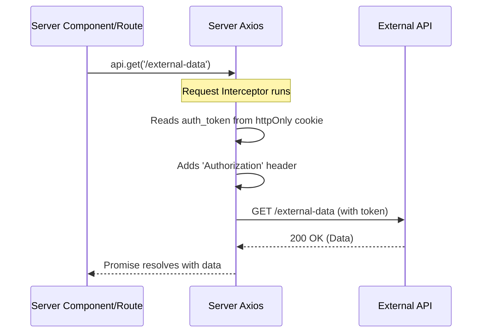
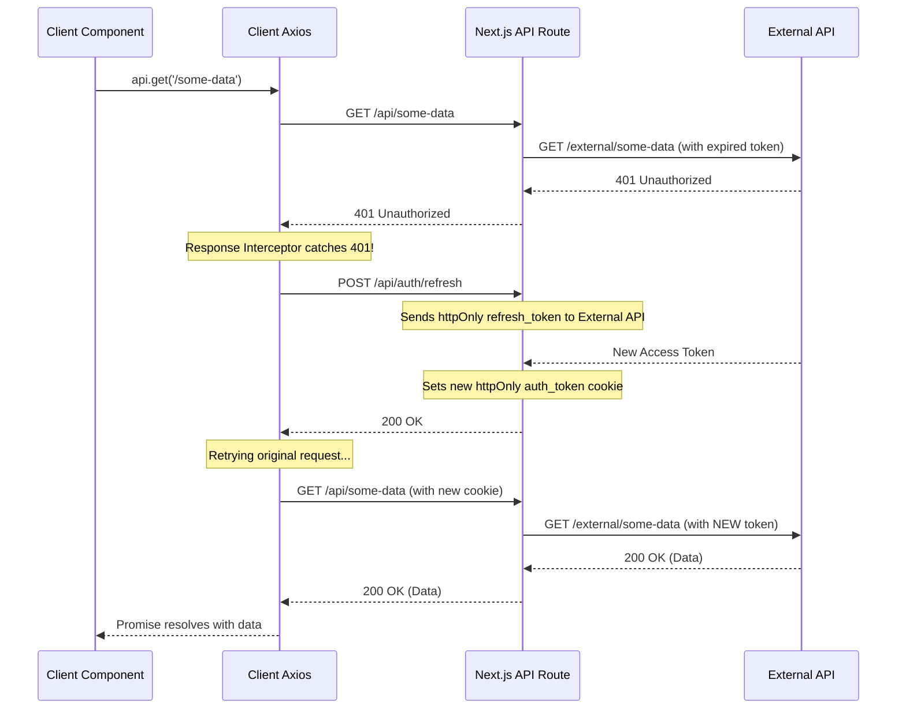

# Authentication Flow Documentation

This document explains the authentication mechanism, which uses two separate Axios instances to securely manage API calls from the client-side and server-side in a Next.js application.

## Core Concept

We use two Axios instances to handle the two different environments where our code runs:

1.  **`src/lib/axios.ts` (Client Instance):** Runs in the user's browser. It is responsible for managing the user's session, including transparently refreshing expired tokens. It calls our own Next.js API routes.

2.  **`src/lib/axios.server.ts` (Server Instance):** Runs on the Next.js server (in Server Components and API Routes). It is responsible for securely forwarding requests to our external backend API by injecting the user's `auth_token` from `httpOnly` cookies.

---

## Flow 1: Server-Side Request

This flow occurs when a Server Component (like `RootLayout`) or an API Route needs to fetch data from the external backend.

**Diagram:**

**Explanation:**
1.  A server-side process needs data.
2.  It uses the `axios.server` instance.
3.  The **request interceptor** automatically reads the `auth_token` from the browser's `httpOnly` cookie.
4.  It attaches this token to the `Authorization` header.
5.  The request is sent to the external API, which validates the token and returns data.

---

## Flow 2: Client-Side Request & Token Refresh

This is the most common flow for interactive components. It shows how an expired token is handled seamlessly without the user noticing.

**Diagram:**

**Explanation:**
1.  A client component calls an API using the client `axios` instance.
2.  The request goes to a Next.js API route, which forwards it to the external API. The token is expired, so the external API returns a `401 Unauthorized` error.
3.  The client `axios` **response interceptor** catches the `401` error.
4.  It pauses all other pending requests and sends a single request to `/api/auth/refresh`.
5.  The refresh endpoint uses the secure `httpOnly` `refresh_token` to get a new `auth_token` and sets it in the browser's cookies.
6.  Once the token is refreshed, the interceptor automatically **retries the original failed request**.
7.  This time, the request succeeds, and the data is returned to the component. The user never knows this happened.
